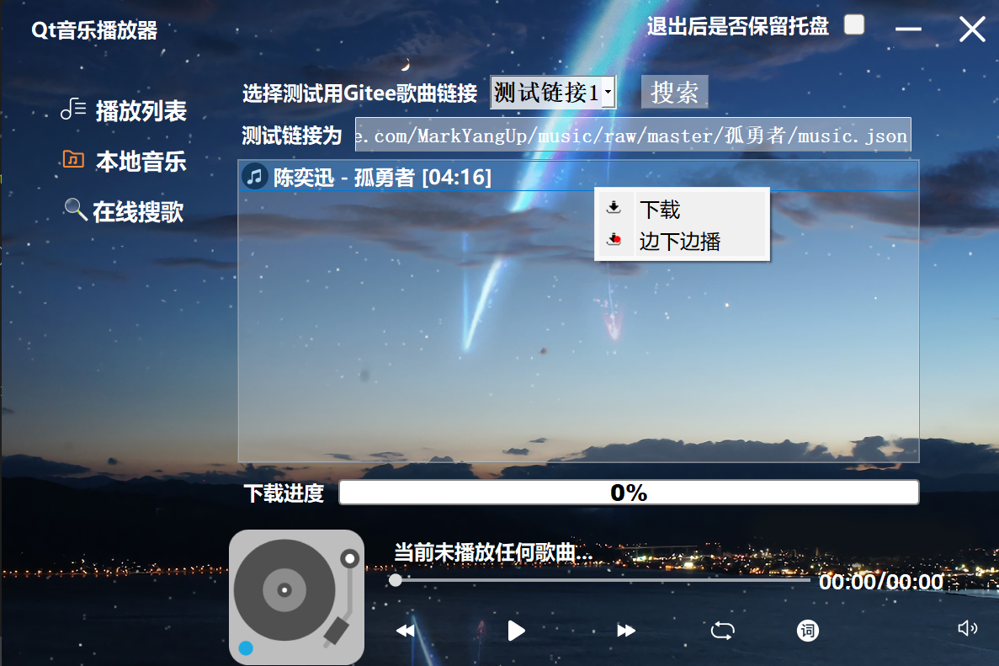
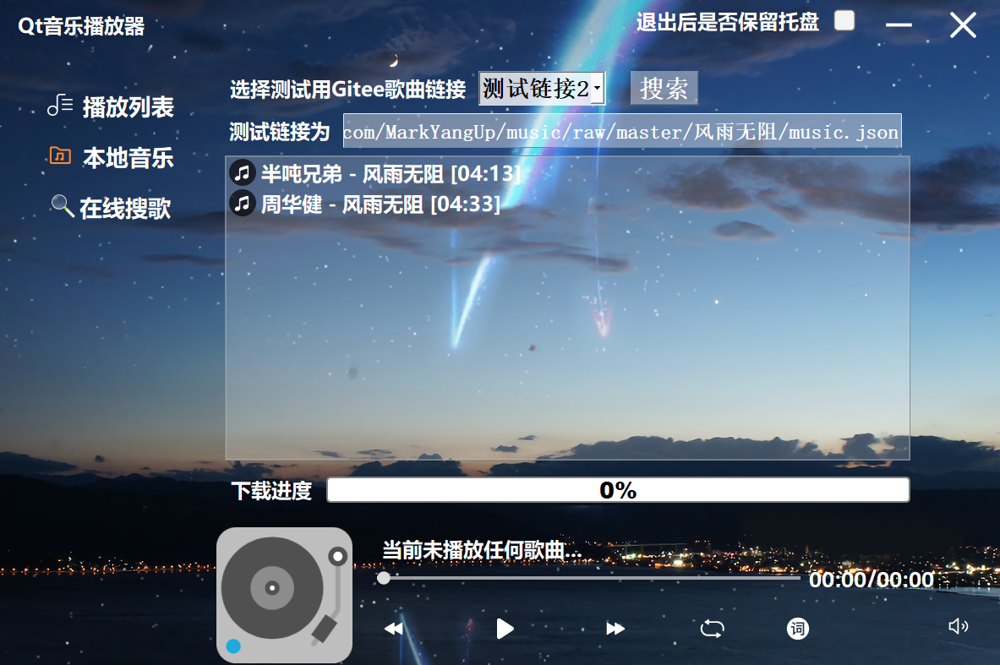
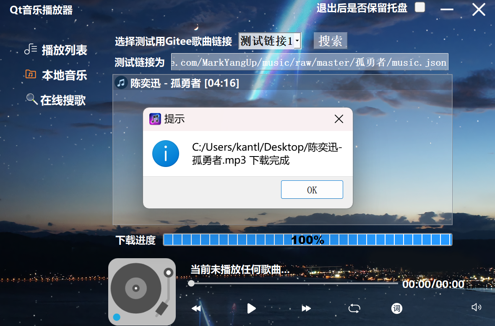
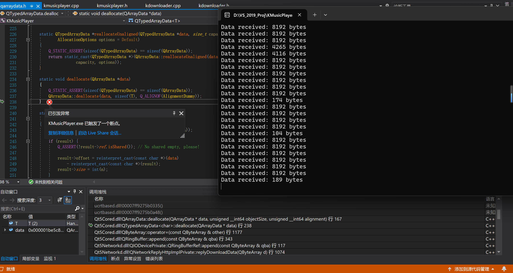

# 音乐播放器

## 实现的功能

- [x] 下载歌曲
- [x] 播放本地歌曲
- [x] 显示歌词
- [x] 上一曲
- [x] 下一曲
- [x] 播放/暂停
- [x] 调整音量
- [x] 拖拽进度条调整播放进度，歌词同步更新进度
- [x] 随机播放、单曲循环、循环播放
- [x] 最小化托盘
- [x] 去除边框
- [x] 鼠标拖拽可移动窗口位置
- [x] 拖入本地音乐文件到窗口中，即可添加到本地列表

## 用到的技术

- [x] `SQLite3`数据库
- [x] `QThread`多线程
- [x] 正则表达式匹配歌词时间
- [x] QSS设计界面样式
- [x] 自定义组件，继承自`QListWidget`，实现歌曲列表
- [x] 重写鼠标按下事件、移动事件、释放事件、绘图事件
- [x] 重写`dragEnterEvent` 和 `dropEvent` 事件，实现拖放效果
- [x] 单例模式
- [x] RAII

## 演示截图








## 遇到的问题

### 多线程下载总是抛出异常，调试了一天也没好



解决方法：

在主类中实例化需要放在新的线程中执行的类时，传递一个父对象即可，例如：

```cpp
m_jsonDownloader = new KDownloader(this);
m_musicDownloader = new KDownloader(this);
m_lyricDownloader = new KDownloader(this);
m_imgDownloader = new KDownloader(this);
m_musicPlayDownload = new KDownloader(this);
```

### 歌曲无法解析元数据

问题原因：传递路径的时候，不能使用QString类型的路径，需要使用QUrl::fromLocalFile转换一下为下面的格式

> QUrl("file:///C:/Users/kantl/Desktop/陈奕迅-孤勇者.mp3")

## 鸣谢

感谢 [jintianjuedingjintian](https://gitee.com/jintianjuedingjintian) 开发的 [Qt5-MusicPlayer](https://gitee.com/NJU-TJL/Qt5-MusicPlayer) 项目，本项目基于此项目二次开发，特此鸣谢！

如有侵权请通过邮件与我联系，会及时处理。
